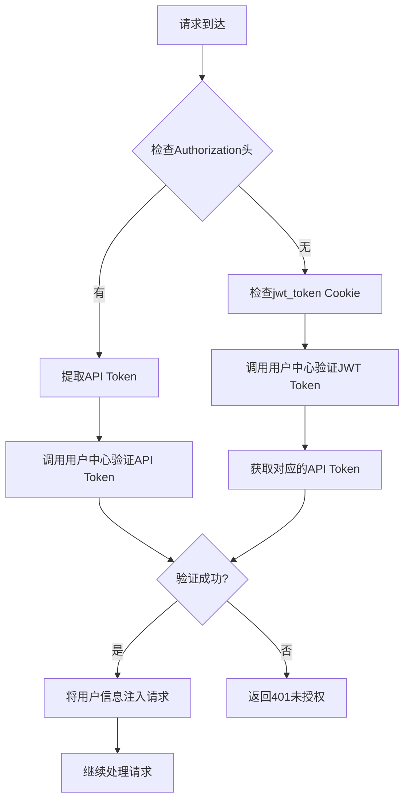

# 用户中心对接方案

本文档描述了图像工具API与用户中心的完整对接方案，包括认证、计费等功能。

## 架构概述

我们的系统采用微服务架构，共享统一的用户中心。所有产品都通过用户中心进行用户认证和计费管理。

### 核心组件

1. **用户中心API客户端** (`app/services/user_center_client.py`)
2. **认证中间件** (`app/middleware/auth_middleware.py`)
3. **计费服务** (`app/services/billing_service.py`)
4. **前端认证逻辑** (`frontend/src/contexts/AuthContext.tsx`)

## 认证机制

### 双重认证支持

系统支持两种认证方式：

1. **API Token认证**（优先级更高）
   - 从`Authorization`请求头获取
   - 格式：`Bearer aigc-hub-xxxxxx` 或直接传递token
   - 适用于API调用

2. **JWT Token认证**
   - 从`jwt_token` cookie获取
   - 需要先调用用户中心API获取对应的api_token
   - 适用于Web界面

### 认证流程



## 计费机制

### 三步计费流程

1. **预扣费**：在功能执行前扣除预估费用
2. **执行功能**：执行实际的业务逻辑
3. **结算**：
   - 成功：追加扣费（如果需要）
   - 失败：返还所有费用

### 计费API

```python
# 预扣费
call_id = await billing_service.pre_charge(
    api_token=user.api_token,
    api_path="/api/v1/watermark",
    context={"image_size": "1920x1080"},
    estimated_tokens=1,
    remark="水印添加"
)

# 返还费用（失败时）
await billing_service.refund_all(call_id, "处理失败")

# 追加扣费（成功但需要额外费用时）
await billing_service.charge_more(call_id, 2, "高分辨率处理")
```

## 前端集成

### 导航栏功能

- **未登录状态**：显示登录和注册按钮
- **已登录状态**：显示用户头像、昵称和下拉菜单

### 用户菜单

- 用户中心：跳转到 `https://usersystem.aigchub.vip/`
- 产品中心：跳转到 `https://www.aigchub.vip/products`
- 退出登录：清除jwt_token cookie

### 登录流程

1. 用户点击登录按钮
2. 跳转到用户中心登录页面（携带redirect_url）
3. 用户在用户中心完成登录
4. 用户中心重定向回原页面（携带jwt_token参数）
5. 前端检测到jwt_token参数，保存到cookie并清除URL参数
6. AuthContext自动检测并更新认证状态

## 配置说明

### 环境变量

```bash
# 用户中心配置
USER_CENTER_BASE_URL=https://usersystem.aigchub.vip
USER_CENTER_INTERNAL_TOKEN=aigc-hub-big-business

# API配置
API_TIMEOUT=30

# 计费配置
DEFAULT_TOKEN_COST=1
```

### 不需要认证的路径

在`auth_middleware.py`中配置：

```python
EXCLUDED_PATHS = {
    "/",
    "/docs",
    "/openapi.json",
    "/redoc",
    "/favicon.ico"
}

EXCLUDED_PATH_PREFIXES = {
    "/generated/",
    "/api/v1/auth-example/public"
}
```

## 使用示例

### 后端路由集成

```python
from fastapi import APIRouter, Request, Depends
from ..middleware.auth_middleware import get_current_user, get_current_api_token
from ..services.billing_service import billing_service

@router.post("/api/v1/watermark")
async def add_watermark(
    request: Request,
    data: WatermarkRequest,
    current_user: User = Depends(get_current_user),
    api_token: str = Depends(get_current_api_token)
):
    # 1. 预扣费
    call_id = await billing_service.pre_charge(
        api_token=api_token,
        api_path="/api/v1/watermark",
        context=data.dict(),
        estimated_tokens=1,
        remark="水印添加"
    )
    
    if not call_id:
        raise HTTPException(status_code=402, detail="余额不足")
    
    try:
        # 2. 执行业务逻辑
        result = await watermark_service.add_watermark(data)
        
        # 3. 追加扣费（如果需要）
        # await billing_service.charge_more(call_id, additional_tokens)
        
        return {"code": 200, "data": result}
        
    except Exception as e:
        # 4. 失败时返还费用
        await billing_service.refund_all(call_id, f"处理失败: {str(e)}")
        raise HTTPException(status_code=500, detail=str(e))
```

### 前端认证检查

```typescript
import { useAuth } from '../contexts/AuthContext';

const MyComponent: React.FC = () => {
  const { isAuthenticated, user, login, logout } = useAuth();
  
  if (!isAuthenticated) {
    return <div>请先登录</div>;
  }
  
  return (
    <div>
      <h1>欢迎, {user?.nickname}!</h1>
      <p>余额: {user?.token_balance} tokens</p>
    </div>
  );
};
```

## 测试

运行测试脚本验证用户中心API：

```bash
python test_user_center.py
```

## 部署注意事项

1. 确保设置正确的环境变量
2. 用户中心的内部API token需要保密
3. 在生产环境中限制CORS域名
4. 定期检查用户中心API的可用性

## 故障排除

### 常见问题

1. **401未授权错误**
   - 检查jwt_token是否有效
   - 检查用户中心API是否可访问
   - 验证内部API token是否正确

2. **402余额不足错误**
   - 用户余额不足
   - 预扣费API调用失败

3. **前端认证状态不更新**
   - 检查cookie设置是否正确
   - 验证JWT token格式
   - 查看浏览器控制台错误信息

### 日志查看

```bash
# 查看应用日志
tail -f logs/app.log

# 查看后端日志
tail -f logs/backend.log
```
